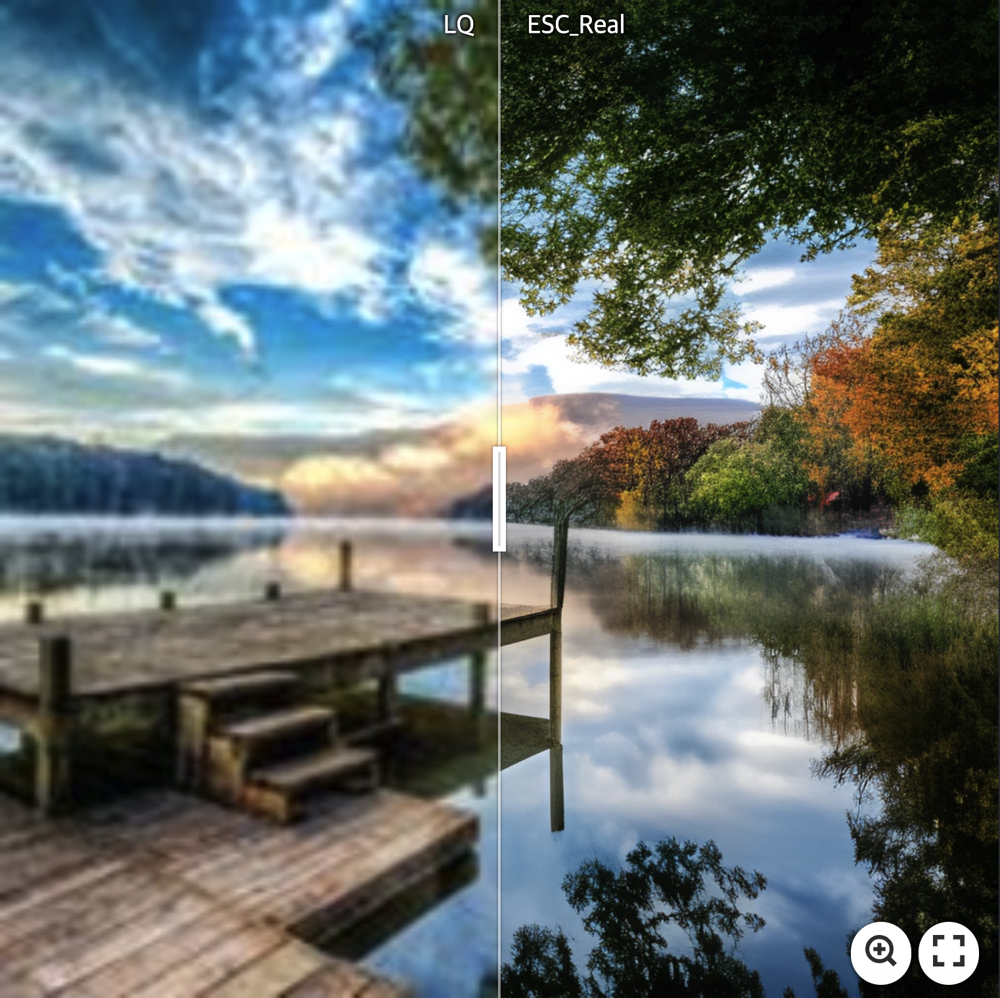
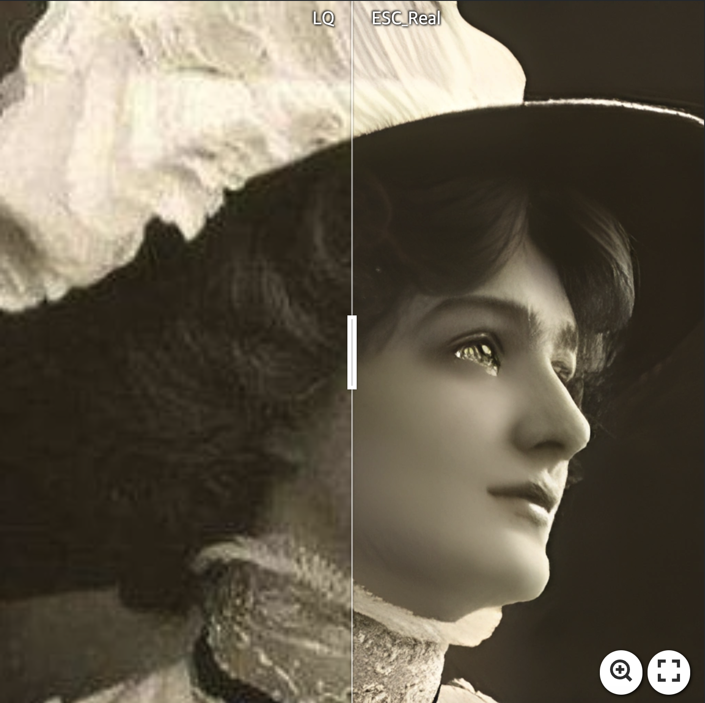
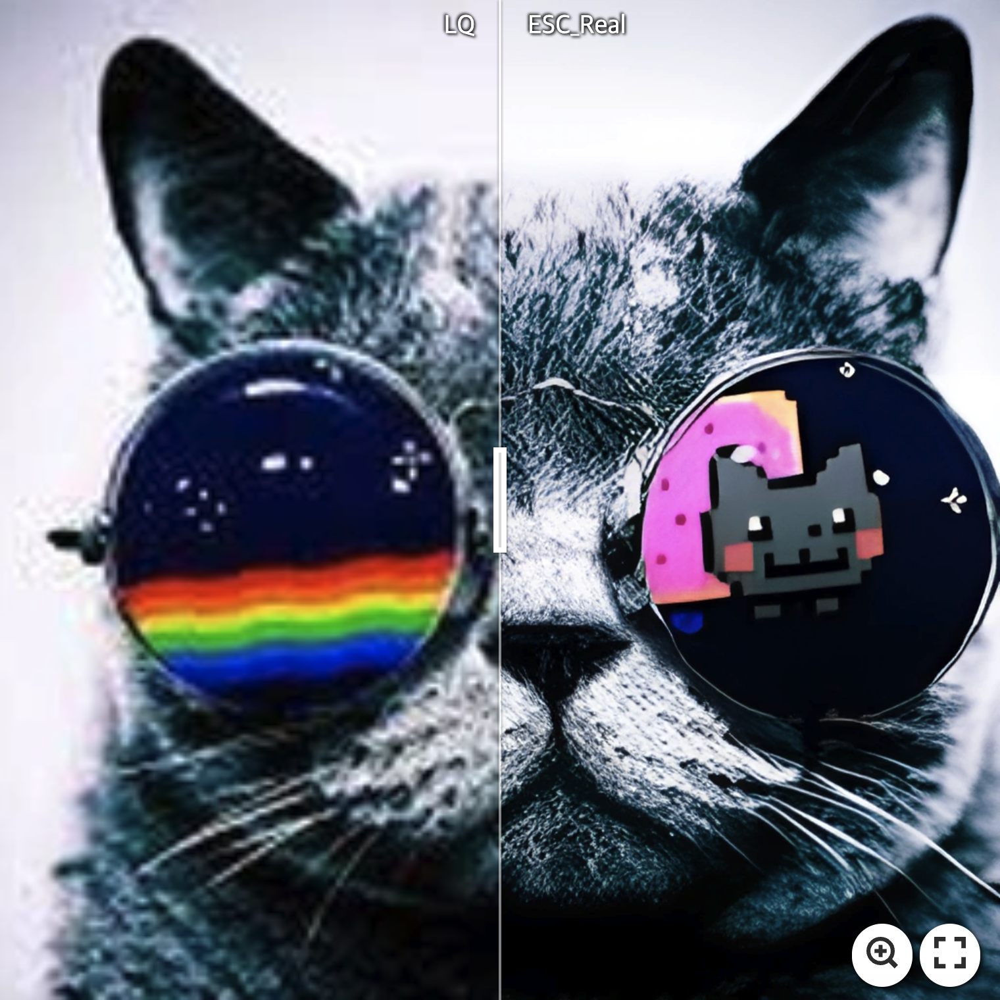

# ESC: Emulating Self-attention with Convolution for Efficient Image Super-Resolution


>In this paper, we tackle the high computational overhead of transformers for lightweight image super-resolution. (SR). Motivated by the observations of self-attention's inter-layer repetition, we introduce a convolutionized self-attention module named Convolutional Attention (ConvAttn) that emulates self-attention's long-range modeling capability and instance-dependent weighting with a single shared large kernel and dynamic kernels. By utilizing the ConvAttn module, we significantly reduce the reliance on self-attention and its involved memory-bound operations while maintaining the representational capability of transformers. Furthermore, we overcome the challenge of integrating flash attention into the lightweight SR regime, effectively mitigating self-attention's inherent memory bottleneck. We scale up window size to 32×32 with flash attention rather than proposing an intricated self-attention module, significantly improving PSNR by 0.31dB on Urban100×2 while reducing latency and memory usage by 16× and 12.2×. Building on these approaches, our proposed network, termed Emulating Self-attention with Convolution (ESC), notably improves PSNR by 0.27 dB on Urban100×4 compared to HiT-SRF, reducing the latency and memory usage by 3.7× and 6.2×, respectively. Extensive experiments demonstrate that our ESC maintains the ability for long-range modeling, data scalability, and the representational power of transformers despite most self-attentions being replaced by the ConvAttn module.

This repository is an official implementation of the paper "Emulating Self-attention with Convolution for Efficient Image Super-Resolution", ICCV, 2025.

by Dongheon Lee, Seokju Yun, and Youngmin Ro

[[Paper]](https://arxiv.org/abs/2503.06671) [[Pre-trained Models]](https://github.com/dslisleedh/ESC/releases/tag/1.0.0)

## Real-world SR Visual Results
[](https://imgsli.com/MzY1MTE3) [](https://imgsli.com/MzY1MTI1) [](https://imgsli.com/MzY1MTI4)  

[](https://imgsli.com/MzY1MTMx) [](https://imgsli.com/MzY1MTM3) [](https://imgsli.com/MzY1MTQy)

## Installation

```bash
git clone https://github.com/dslisleedh/ESC.git
cd ESC
conda create -n esc python=3.10
conda activate esc
pip3 install torch torchvision torchaudio  # pytorch 2.6.0 and cuda 12.4
pip install -r requirements.txt 
python setup.py develop
```

## Training

### Single GPU
```bash
python esc/train.py -opt $CONFIG_PATH
```

### Multi GPU (local)
```bash
PYTHONPATH="./:${PYTHONPATH}" CUDA_VISIBLE_DEVICES=0,1,2,3 python -m torch.distributed.launch\
  --nproc_per_node=4 --master_port=5612 \
 esc/train.py -opt $CONFIG_PATH --launcher pytorch
```

### Multi GPU (SLURM)
```bash
PYTHONPATH="./:${PYTHONPATH}" GLOG_vmodule=MemcachedClient=-1 srun -p $PARTITION --mpi=pmi2 \
    --gres=$GPUS --ntasks=4 --cpus-per-task $CPUs --kill-on-bad-exit=1 \
    python -u esc/train.py -opt $CONFIG_PATHl --launcher="slurm" 
```

## Testing
```bash
python esc/test.py -opt $CONFIG_PATH
```

## Results

### ClassicSR Quantitative Results on the DIV2K dataset


### ClassicSR Quantitative Results on the DFLIP dataset
DFLIP datasets consist of 4 datasets: DIV2K, Flickr2K, LSDIR, and DiverSeg-IP.
We leverage the DFLIP datasets to demonstrate our method's data scalability.


### Arbitrary-scale SR Quantitative Results


### Real-world SR Quantitative Results


## Acknowledgement
This work is based on [BasicSR](https://github.com/XPixelGroup/BasicSR) and [HAT](https://github.com/XPixelGroup/HAT). We thank them for their great work and for sharing the code.

